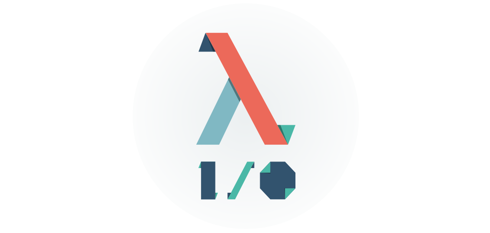

# O Manifesto Lambda I/O

> Não, esse projeto não tem relação com o uso de programação funcional com
tratamento monádico para efeitos colaterais. Na verdade, é uma iniciativa aberta
para **espalhar conhecimento de programação funcional pelo mundo**.

## Tabela de Conteúdos

- [Quem somos?](#quem-somos)
- [Motivação](#motivação)
- [Como?](#como)
- [Nossos Princípios](#nossos-princípios)
- [Links Úteis](#links-Úteis)
- [Traduções](#traduções)
- [Contribuições](#contribuições)
- [Licença](#licença)

## Quem somos?

A Fundação Lambda I/O consiste de uma iniciativa aberta que visa a
introduzir as pessoas ao redor do mundo a todos os recursos e benefícios de se
conhecer o paradigma de programação funcional.

Pretendemos fazer isso através da organização de pequenos meetups - com um
ambiente acolhedor - sobre programação funcional pelo mundo que culminariam em
uma grande conferência por país.

Nossa missão é desconstruir a doutrinação a cerca do ensino de linguagens
imperativas que, infelizmente, assola muitos lugares do mundo e,
consecutivamente, seus sistemas de ensino de TI - desde cursos técnicos a
pós-graduações -, fornecendo recursos e uma comunidade que tornaria muito mais
fácil de se aprender sobre programação funcional, linguagens funcionais, casos
de uso etc.

## Motivação

Esta iniciativa nasceu no Brasil, criada por um pequeno grupo aluno técnicos e
de graduação que estavam simplesmente cansados de aprender sempre os mesmos
conceitos relacionados a linguagens imperativas em suas aulas.

À medida que o [buzz funcional](https://medium.com/@jugoncalves/functional-programming-should-be-your-1-priority-for-2015-47dd4641d6b9)
cresce, é muito comum ver hoje em dia pessoas que se perguntam o que é
programação funcional e querem aprender, mas não encontram os recursos adequados,
motivação ou mesmo uma comunidade para apoiar seus estudos, e então, desistem
de aprender. A situação torna-se ainda pior quando percebemos que muitos
profissionais de TI, pessoas que lidam com desenvolvimento de software - e até
mesmo estudantes de Ciência da Computação - que nunca ouviram falar de um
paradigma diferente, como o funcional.

## Como?

### Meetups

A ideia é fazer pequenos meetups Lambda I/O por cidade. Essas meetups consistem
encontros de um dia com palestras - e talvez workshops - sobre tudo no mundo
funcional:

- O paradigma em si
- *Linguagens puristas*
- Bibliotecas e implementações funcionais
- Paralelismo/Concorrência
- Benefícios
- Casos de uso
- ...

Os *Lambda I/O Meetups* têm um pré-formato que pode ser encontrado [aqui](https://github.com/lambda-io/meetup-organization-guidelines).

### Conferências

Os pequenos meetups objetivam promover o conhecimento de funcional de uma maneira
distribuída/*(des)centralizada*, mas eles não são o suficiente, uma vez que são
exatamente **pequenos meetups**. Por isso, também é importante promover grandes
conferências anuais que unam grandes quantidades de pessoas por país.

Os *Lambda I/O Meetups* têm um pré-formato que pode ser encontrado [aqui](https://github.com/lambda-io/conference-organization-guidelines).

## Nossos Princípios

### As pessoas são importantes

Como dito na seção [Motivação](#motivacao), as pessoas são a nossa razão. Por
isso, é muito importante pensar sobre a sua experiência - ajudando-as e sendo o
mais legal possível. O paradigma funcional pode ser incrível - então por que
não podemos tentar fazer as pessoas aprendendo-o se sentirem incríveis também?

### (Des)centralização

Nossas filosofia é baseada em um modelo centralizado de descentralização. Para
ajudar a compreensão, este pode ser dividido em dois pontos:

#### Descentralização

- **Qualquer um** tem a liberdade de organizar eventos Lambda I/O **quando** e
**onde** quiser.

- Os meetups são **independentes** uns dos outros.

- A Fundação Lambda I/O não define detalhes específicos de cada meetup - como
*datas, agenda, patrocinadores, apoiadores* etc.

#### Centralização

- Para facilitar a organização dos meetups - e a integração destes com a
proposta da fundação -, todos os repositórios organizacionais de meetups e
conferências estão reunidos na organização do Github da [Fundação Lambda I/O](https://github.com/lambda-io).
Para cada meetup deve ser criada uma equipe que terá completo poder de definir
os detalhes descritos no princípio da [descentralização](# descentralização) e
as equipas só têm acesso aos seus meetups - assegurando a sua independência. O
nascimento de um meetup - e sua respectiva equipe na organização no Github da
[Fundação Lambda I/O](https://github.com/lambda-io) - precisa apenas da
manifestação de interesse por um possível facilitador como declarado [aqui](https://github.com/lambda-io/meetup-organization-guidelines).

- Todos os eventos - meetups e conferências - **devem aderir aos princípios
básico da Fundação** - como a sua proposta, código de conduta, etc.

## Links Úteis

> Nosso objetivo é ter muitos repositórios para ajudar as pessoas com toda a
proposta *Lambda I/O*, são eles:

- [Manual de Organização dos Meetups](https://github.com/lambda-io/meetup-organization-guidelines)

  Um guia simples sobre como organizar meetups Lambda I/O.

- [Manual de Organização das Conferências](https://github.com/lambda-io/conference-organization-guidelines)

  Um guia simples sobre como organizar conferências Lambda I/O.

- [Recursos](https://github.com/lambda-io/resources)

  Repo contendo alguns recursos que visam a ajudar os organizadores de eventos Lambda I/O.

- [Código de Conduta](https://github.com/lambda-io/code-of-conduct)

  Algo necessário a qualquer evento.

- [Gerador de Logos de Meetups](https://github.com/lambda-io/meetup-logo-generator)

  Gerador de logos para cada meetup local.

- [Meetup/Conference Site Boilerplate](https://github.com/lambda-io/site-boilerplate)

  Uma maneira fácil de criar o site de seu evento Lambda I/O.

## Traduções

> Este manifesto objetiva ser traduzido no maior número de linguagens o possível.
Neste momento, estes são as versões disponíveis. Se você sentir falta de algum
idioma e quiser nos ajudar, fique à vontade para [contribuir](#contribuicoes).

- [English](README.md)
- [Español](es/README.md)

## Contribuições

Contribuições são muito bem-vindas! Se você gostaria de nos ajudar em nossa
missão, as orientações para contribuições pode ser encontradas [aqui](CONTRIBUTING.md).

## Licença

A documentação em torno do **Manifesto Lambda I/O** e tudo neste repositório
está licenciado sob uma licença [Creative Commons Attribution 4.0 Internacional](http://creativecommons.org/licenses/by-nc/4.0/)
exceto o logotipo e outras imagens, que estão licenciados sob uma licença [Creative Commons Attribution-NoDerivatives 4.0 Internacional](http://creativecommons.org/licenses/by-nc-nd/4.0/).

*Todas as contribuições também devem ser licenciadas sob as mesmas.*
